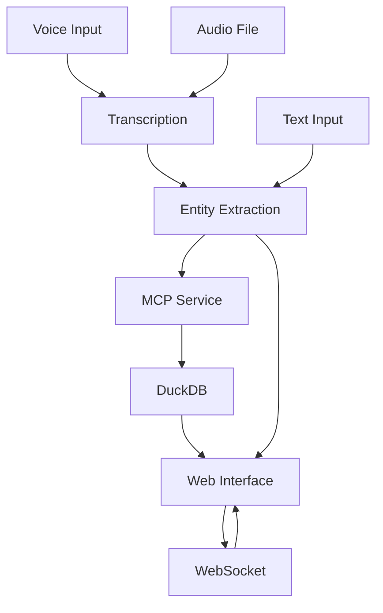

# Architecture Overview

## System Components

### 1. Voice Input Layer
- **Web Audio API**: Captures audio from user's microphone
- **File Upload**: Alternative audio input method
- **WebSocket**: Real-time communication with server

### 2. Mastra Agent
- **Transcription Service**: OpenAI Whisper integration
- **Entity Extraction**: GPT-4 powered entity identification
- **Pattern Matching**: Fallback entity extraction using regex
- **Analysis Engine**: Generates insights from extracted entities

### 3. MCP Service (Model Context Protocol)
- **Tool Interface**: Standardized operations for database interaction
- **Resource Management**: Handles database connections and schemas
- **CRUD Operations**: Create, Read, Update, Delete entities and conversations

### 4. Data Storage Layer
- **DuckDB**: High-performance analytical database
- **Schema Design**: Optimized for entity relationships and analytics
- **Indexing**: Performance-optimized queries

### 5. Web Interface
- **Real-time UI**: WebSocket-powered live updates
- **Multi-modal Input**: Voice, file upload, and text input
- **Data Visualization**: Entity display and database browsing

## Data Flow

## Entity Types

The system extracts and categorizes the following entity types:

- **Person**: Names, roles, contacts
- **Organization**: Companies, departments, teams
- **Location**: Addresses, cities, countries  
- **Event**: Meetings, deadlines, appointments
- **Product**: Items, services, features
- **Financial**: Amounts, budgets, costs
- **Contact**: Email addresses, phone numbers
- **Date**: Dates and date ranges
- **Time**: Times and time ranges

## MCP Integration

The Model Context Protocol (MCP) provides a standardized interface for:

- **Tools**: `store_entity`, `get_entities`, `store_conversation`
- **Resources**: Access to the DuckDB entity database
- **Extensibility**: Easy addition of new tools and capabilities

## Performance Considerations

- **Streaming**: WebSocket enables real-time processing
- **Batch Operations**: Efficient bulk entity storage
- **Indexing**: Optimized database queries
- **Caching**: In-memory caching for frequently accessed data
- **Fallback**: Graceful degradation when external APIs are unavailable 